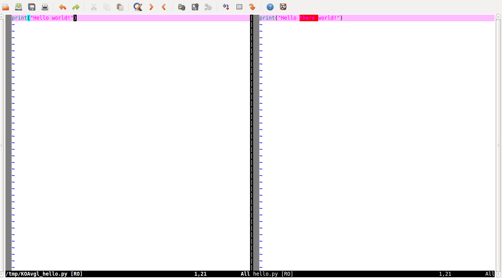
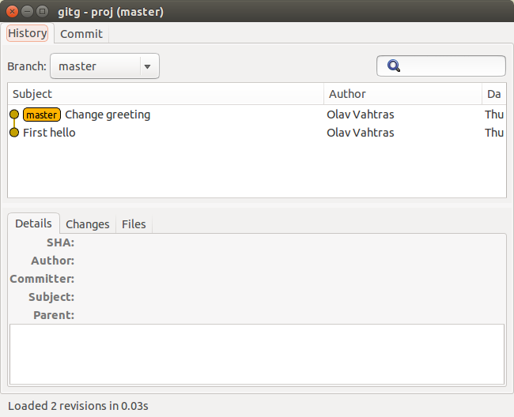

# Version Control: git

## Olav Vahtras

### KTH Royal Institute of Technology

Software Carpentry Workshop Potsdam 2015-04-13

---

layout: false

## Learning objectives

* What version control is

* Why we should use version control

* Why we choose use git

* Know the basic elements of git workflow
    - How to save history
    - How to undo mistakes
    - Know about the basic components 
        + work directory
        + staging area
        + local repository
        + remote repository


---
## What is version control:
-

* A Version Control System (VCS) is a framework that tracks the history of a project

* The history of a project is a sequence of versions
```
1 -> 2 -> 3 ...
```

* At any point in time we can go back to a previous version

* A VCS allows you to compare different versions

* A VCS allows several users to work on the same project files simultaneously
---

## Why use version control


---

## A manual VCS

```
$ cp -r Project Project.save
```
... work 
```
$ cp -r Project Project.save.v2
```
... work 
```
$ cp -r Project Project.save.v2.new
```

---

## Version control systems of the past
### RCS (Revision Control System)

* A file-level local version control system

* Can be used by multiple collaborators on a shared file system

* One user at a time can edit

* Not possible for multi-file projects as each file has its own history.

---
## Version control systems of the past
### CVS (Concurrent Versions System)

* First project-level (> 1 file) version-control

* A central server

* Users could checkout project files to work with

* Users needed contact with the server to save work and compare work
---

## Version control systems of the past

### Subversion (svn)

* An improvement over CVS

* When a user checks out a project a local reference is maintained

* Development branches are possible

* Merging branches

---

## Introducing git


* Written by Linus Thorvalds, originally for the Linux kernel

* A distributed VCS

* Several servers have all information

* Any one can be chosen as the reference version

* One of the most popular frameworks today (others: bazaar, mercurial)

---

## When to use

#### Why

* For source code development

* For manuscripts

* In single-user projects

* In collaborative projects

*Practically always*

#### Benefits

* No history is lost

* All versions of your documents are preserved

* Easy to backup to other sites


---

### Setup

#### The first time around
```
    $ git config --global user.name "First Last"
    $ git config --global user.email "first.last@isp.com"
```

Creates a configuration file ``~/.gitconfig``
```
    [user]
	name = First Last
	email = first.last@isp.com

```
*Note*:    You can create and edit the file directly

**Exercise:** Make sure you have git installed and you have this initial setup.

---

### Initializing a repository: `git init`

* Use an existing directory or create a new project directory
```
    $ mkdir proj
```

* Go to the directory and initialize
```
    $ cd proj
    $ git init
    Initialized empty Git repository in /tmp/proj/.git/
    $ ls -a
    .  ..  .git
```

* Check repository status
```
    $ git status
    On branch master

    Initial commit

    nothing to commit (create/copy files and use "git add" to track)
```

---

### Adding files: `git add`

* Create a file with one line
```
    #hello.py
    print("Hello world!")
```
```bash
    $ python hello.py
    Hello world!
```
* Recheck status
```bash
    $ git status
    On branch master

    Initial commit

    Untracked files:
      (use "git add <file>..." to include in what will be committed)

	    hello.py

    nothing added to commit but untracked files present (use "git add" to track)
```
* Git warns about files in the project directory that not tracked

---

* Tell Git to start tracking 
```bash
    $ git add hello.py
```
```bash
    $ git status
    On branch master

    Initial commit

    Changes to be committed:
      (use "git rm --cached <file>..." to unstage)

	    new file:   hello.py
```
* It is now a tracked file
* It is not yet in the repository


### The staging area
* After an add operation a file is in the staging area (cache)
* This is an intermediate level between the work directory and repository

---

### The repository
* Save the latest changes in the local repository (``.git`` directory)
```
    $ git commit -m "First hello"
    [master (root-commit) edf197e] First hello
     1 file changed, 1 insertion(+)
     create mode 100644 hello.py
```
* Check the status again
```
    $ git status
    On branch master
    nothing to commit, working directory clean
```
* Check history
```bash
$ git log
commit 8b56bb1755d6d8f2bb54cdb6c672b6f47196de1f
Author: Olav Vahtras <vahtras@kth.se>
Date:   Wed Aug 23 10:11:16 2015 +0200

    First hello
```
---

### Summary of five basic Git commands

#### operations

* `init` create a repository
* `add`  add new file
* `commit` save in repo

#### inquires

* `status`: inquire state of directory
* `log`: inquire history of direct

---

### The work cycle
There are three levels, from "lowest"

* The work directory
* The staging area
* The repository


```
repository (.git)
    ^
    |   commit

staging area (cache)

    ^
    |   add

work directory     <- init
```

A single file may be represented att all levels


The basic work cycle is edit-add-commit
```
    $ nano <file> #edit a file
    $ git add <file> #adds new file or saves latest changes
    $ git commit -m <message> <file> #save permanently in repository
```

---

### Viewing changes: `git diff`

* Change the file

```
    # hello.py
    print("Hello there world!")
```
* and Git recognizes this file as modified

```
    $ git status
    On branch master
    Changes not staged for commit:
      (use "git add <file>..." to update what will be committed)
      (use "git checkout -- <file>..." to discard changes in working directory)

	    modified:   hello.py

    no changes added to commit (use "git add" and/or "git commit -a")
```

---

```
    $ git diff
    diff --git a/hello.py b/hello.py
    index ed708ec..01c97be 100644
    --- a/hello.py
    +++ b/hello.py
    @@ -1 +1 @@
    -print "Hello world!"
    +print "Hello there world!"
```

```
    $ git difftool
```



---

### Update repository
```
    $ git add hello.py

    $ git commit -m "Change greeting"
    [master f7efe62] Change greeting
     1 file changed, 1 insertion(+), 1 deletion(-)

    $ git log
    commit f7efe62016fcd70fbdbd2232f9086bfd96aaf413
    Author: First Last <first.last@isp.com>
    Date:   Thu Oct 16 18:32:41 2014 +0200

        Change greeting

    commit edf197e2974f9365abe3a52e6bde5ae0495d5016
    Author: First Last <first.last@isp.com>
    Date:   Thu Oct 16 17:32:45 2014 +0200

        First hello

```
---

### Graphical frontends
```
    $ gitg
```


---

### Recovering old work
* To retreive old verions, use checkout with the commit string
```
    $ git checkout edf197
    Note: checking out 'edf197'.

    You are in 'detached HEAD' state. You can look around, make experimental
    changes and commit them, and you can discard any commits you make in this
    state without impacting any branches by performing another checkout.

    If you want to create a new branch to retain commits you create, you may
    do so (now or later) by using -b with the checkout command again. Example:

      git checkout -b new_branch_name

    HEAD is now at edf197e... First hello
    $ cat hello.py
    print "Hello world!"
```

---

### Switch back to latest version

```
    $ git status
    HEAD detached at edf197e
    nothing to commit, working directory clean
```

```
    $ git checkout master
    Previous HEAD position was edf197e... First hello
    Switched to branch 'master'
```

```
    $ git status
    On branch master
    nothing to commit, working directory clean
```

```
    $ cat hello.py
    print "Hello there world!"
```

---

### Remote repositories

* Necessary for collaborative projects

* Useful for single-user projects

* Web-services, github, bitbucket

* A shared directory (NFS, AFS, Dropbox....)


* git pull from remote

* git push to remote

```
repository (.git)  <->   remote
                pull,push

    ^
    |   commit

staging area (cache)

    ^
    |   add

work directory     <- init, clone
```

---

### A shared directory repository

* Create an empty remote repository
```
    $ git init --bare ~/Dropbox/proj.git
    Initialized empty Git repository in /home/olav/Dropbox/proj.git/
```
--

* Create an alias for the remote repository
```
    $ git remote add origin ~/Dropbox/hello.git
    $ git remote -v
    origin	/home/olav/Dropbox/proj.git (fetch)
    origin	/home/olav/Dropbox/proj.git (push)
```
--

* Let the local branch track the remote repository
```
    $ git push -u origin master
    Counting objects: 6, done.
    Delta compression using up to 4 threads.
    Compressing objects: 100% (2/2), done.
    Writing objects: 100% (6/6), 473 bytes | 0 bytes/s, done.
    Total 6 (delta 0), reused 0 (delta 0)
    To /home/olav/Dropbox/proj.git
     * [new branch]      master -> master
    Branch master set up to track remote branch master from origin.
```

---


* Now your local is in sync with your remote
* Make another local change

```
    $ cat << EOF > hello.py
    print "HELLO THERE WORLD!"
    EOF
```

```
    $ git add hello.py
```

```
    $ git commit -m "Capitalize"
    [master cb05b3f] Capitalize
     1 file changed, 1 insertion(+), 1 deletion(-)
```

---

### Backup to remote

* View local changes
```
    $ git status
    On branch master
    Your branch is ahead of 'origin/master' by 1 commit.
      (use "git push" to publish your local commits)

    nothing to commit, working directory clean
```

* Backup to remote repository
```
    $ git push
    Counting objects: 5, done.
    Writing objects: 100% (3/3), 269 bytes | 0 bytes/s, done.
    Total 3 (delta 0), reused 0 (delta 0)
    To /home/olav/Dropbox/proj.git
       f7efe62..cb05b3f  master -> master
```

---

### Continue work on another computer

* With access to the same shared file system
```
    |Other> git clone ~/Dropbox/proj.git
    Cloning into 'proj'...
    done.
    |Other> cd proj
```
* work on remote
    - edit -> add -> commit -> push

---

### Back on local

* Retrieve changes that was made on another system

* By you or another developer

```
    $ git pull
    remote: Counting objects: 5, done.
    remote: Total 3 (delta 0), reused 0 (delta 0)
    Unpacking objects: 100% (3/3), done.
    From /home/olav/Dropbox/proj
       cb05b3f..d5fe073  master     -> origin/master
    Updating cb05b3f..d5fe073
    Fast-forward
     hello.py | 2 +-
     1 file changed, 1 insertion(+), 1 deletion(-)

```

---

### Summary of work cycle

* Start a new project
```
    $ git init
```

* Get a copy of existing project
```
    $ git clone
```

* Locally: edit-add-commit
```
    $ nano ...
    $ git add...
    $ git commit...
```
* Sync with remote: pull-push
```
    $ git pull
    $ git push
```

---

### Use a remote server (service)

* github.com (free for public projects)

* gitlab.com  (free for public and private projects)

---

### Github workflow exercise

1. Create account
2. Create a repository on github with the name `hello`
3. In your local repository add the github repository as a remote
4. Push your local project to github
5. Fork the repository of your neighbor to the left
7. Add the neighbours repository as a remote
6. Add the line 'print("Hello neighbor!") to hello.py
9. Push to your own github
10. Make a pull request

---

### Links

* http://git-scm.com/book
* http://software-carpentry.org/v5/novice/git/index.html
* http://www.linux.com/news/featured-blogs/185-jennifer-cloer/821541-10-years-of-git-an-interview-with-git-creator-linus-torvalds
* https://gun.io/blog/how-to-github-fork-branch-and-pull-request/
* http://christoph.ruegg.name/blog/git-howto-revert-a-commit-already-pushed-to-a-remote-reposit.html
* http://git-man-page-generator.lokaltog.net/
